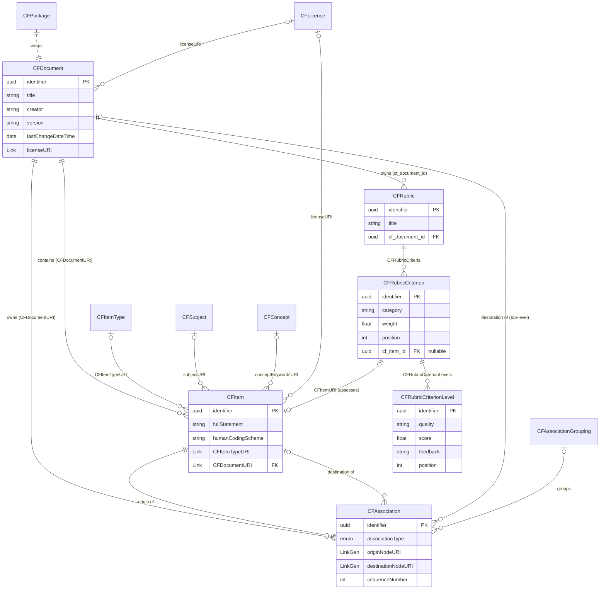

# CASE v1.1 データモデル概観

CASE v1.1 のデータモデルを「全体像 → 関係 → 各エンティティ」の順で図解する入門ドキュメント。
CASE という標準そのものの背景・API・バージョン差は [`case-overview.md`](./case-overview.md) を参照。
フィールドの型・必須/任意の権威的な定義は `docs/reference/case-v1p1-info-model.md`
（および `docs/reference/imscasev1p1_openapi3_v1p0.json`）を参照すること。本書はその地図。

> 図は等幅フォント前提。罫線は左寄せ構造のみで描いているので、全角・半角が混在しても崩れない。

---

## 🔑 最重要の考え方：ツリーは「ツリーとして」保存されない

画面で見える階層ツリーは、実体としては
**「ドキュメント1個 ＋ 項目のフラットな配列 ＋ 関連(枝)のフラットな配列」** で保存される。
親子の線は項目側に持たず、**すべて `CFAssociation`（type=`isChildOf`）が表現**する。

**見た目のツリー:**

```
数学FW
├─ 数と式
│  └─ 整数の計算
└─ 図形
```

**実際の保存のされ方（フラットな3種のレコード）:**

```
CFDocument    : 数学FW
CFItem        : 数と式 ／ 整数の計算 ／ 図形
CFAssociation : 数と式（origin）→ isChildOf → 数学FW（destination）
CFAssociation : 整数の計算（origin）→ isChildOf → 数と式（destination）
CFAssociation : 図形（origin）→ isChildOf → 数学FW（destination）
```

ここを掴めば残りは肉付け。

---

## 1. 全体構造（5レイヤー）

`CFPackage` は1フレームワークを丸ごと束ねた「箱」（import/export の単位）。中身を役割で5層に分ける。

```
CFPackage … 1フレームワーク＝1箱（import/export の単位）
│
├─ CFDocument … ① 入れ物：フレームワークのメタ情報（題名・版・作者）
│    └ CFItem が CFDocumentURI で従属
│
├─ CFItem … ② ノード：1つ1つのコンピテンシー / 到達目標
│    └ origin / destination で関連に参加
│
├─ CFAssociation（＋CFAssociationGrouping）… ③ 枝：項目同士をつなぐ関係（向き＋種類）
│    └ CFAssociationGrouping は枝を束ねるラベル（任意）
│
├─ CFItemType / CFSubject / CFConcept / CFLicense … ④ 語彙：参照マスタ
│    └ CFDefinitions にまとまる。CFItem・CFDocument が `〜URI` フィールドで参照
│
└─ CFRubric → CFRubricCriterion → CFRubricCriterionLevel … ⑤ 評価
     └ 評価基準の3段ネスト。Criterion が CFItem を指せる
```

| # | レイヤー | エンティティ | 役割 |
|---|---|---|---|
| ① | 入れ物 | **CFDocument** | フレームワークのメタ情報 |
| ② | ノード | **CFItem** | 1つ1つのコンピテンシー / 到達目標 |
| ③ | 枝(エッジ) | **CFAssociation**（＋ CFAssociationGrouping） | 項目同士をつなぐ関係 |
| ④ | 語彙(lookup) | **CFItemType / CFSubject / CFConcept / CFLicense** | 項目・文書が `〜URI` で参照する参照マスタ |
| ⑤ | ルーブリック | **CFRubric → CFRubricCriterion → CFRubricCriterionLevel** | 評価基準の3段ネスト |

---

## 2. ③ CFAssociation（ここが肝）

枝は「向き」と「種類」を持つ。`isChildOf` は **origin が child、destination が parent**。

```
origin（子）= CFItem "整数の計算"
   │
   │  associationType = isChildOf
   ▼
destination（親）= CFItem または CFDocument "数と式"
```

`associationType` の主な値:

| 値 | 意味 | 用途 |
|---|---|---|
| `isChildOf` | 階層（ツリーの親子） | ツリー構築の中心 |
| `isPartOf` | 部分-全体 | |
| `isRelatedTo` | ゆるい関連 | |
| `isPeerOf` | 同等 | |
| `precedes` | 順序（前提→後続） | |
| `exactMatchOf` | 別フレームワークの項目と同一 | フレームワーク横断 |
| `isTranslationOf` | 翻訳関係（v1.1新） | |

**フレームワーク横断**: origin/destination は `LinkGenURIDType`（`targetType` を持つ）なので、
**別フレームワークの項目も指せる**。`exactMatchOf` 等で他FWの相当項目に紐付けるのがこの仕組み。
通常の URI 参照（`LinkURIDType`）は identifier が UUID 必須だが、`LinkGenURIDType` は非UUIDも許容する。

**テナント横断（同一インスタンス）**: 関連は**宣言する側のテナントが所有**する。端点の `〜NodeURI` が
同一 compeito インスタンス上の**別テナントの public な CFItem**（`{base_url}/{tenant}/uri/{item}` 形式）を
指す場合、Web UI はそれを解決して相手の title＋「他機関」バッジ＋相手テナントのツリーへの切替リンクを出す。
**private な別テナント**を指す端点は**完全非表示**（存在も title も URI も出さない）。別ホストの真の外部 URL は
従来どおり別タブで開く外部リンクのまま。詳細は web-ui.md の「相互参照の出し分け」を参照。

---

## 3. ④ 参照（`〜URI` フィールドで指す）

> **`〜URI` という命名規約**: CASE では「**他のリソースを参照するフィールド**」の名前を末尾 `URI` に
> そろえる（`licenseURI`, `subjectURI`, `CFItemTypeURI`, `CFDocumentURI`, `CFItemURI` …）。
> 紛らわしいが、**小文字 `uri` はそのリソース自身のアドレス（ただの文字列）**、
> **大文字サフィックス `〜URI` は他リソースへの参照（複合オブジェクト）** と使い分けている。
> 本書で `〜URI` と総称するときは、この「末尾 URI の参照フィールド群」を指す（`〜` は仕様の記法ではない）。

語彙マスタは FK ではなく、`〜URI` フィールドが持つ **複合オブジェクト**（`{title, identifier, uri}`）で
“ゆるく”参照される。`identifier` が参照先リソースの UUID。

```
"licenseURI": {
  "title": "CC BY 4.0",
  "identifier": "0c5c…e9",                      ← 参照先リソースの UUID
  "uri":  "https://example.org/uri/0c5c…e9"     ← 参照先の解決先アドレス
}
```

| 参照元 | フィールド | 参照先 |
|---|---|---|
| CFItem | `CFItemTypeURI` | CFItemType（項目の種類: 領域/目標/…）|
| CFItem | `subjectURI`（配列）| CFSubject（教科）|
| CFItem | `conceptKeywordsURI` | CFConcept（概念タグ）|
| CFItem / CFDocument | `licenseURI` | CFLicense（ライセンス）|
| CFAssociation | `CFAssociationGroupingURI` | CFAssociationGrouping |
| CFRubricCriterion | `CFItemURI` | CFItem（この基準が評価する項目）|

### 単数で解決する参照 vs 複数になる参照

リンクは「**前向きのスカラー参照（単数＝配列ではない）**」と「**配列参照・逆向き/集約（複数になる）**」に
分かれる。compeito の UI もこれに従い、単数参照は（値があれば）単独リンク（例: 「対象アイテムを表示」）、
複数になりうる参照は**リストで並べて**表示する。

**単数参照（配列ではない。あれば最大1つに解決）= 前向きのスカラー参照**

> 「単数」は「配列ではない」の意味で、**必ず存在するわけではない**。仕様上ほとんどが任意（Required=NO）で、
> 値が無ければ UI にリンクは出ない。必須なのは CFAssociation の `originNodeURI` / `destinationNodeURI` と、
> standalone 取得時の CFItem `CFDocumentURI`。

| 元 | リンク | 先 | 必須? |
|---|---|---|---|
| CFItem | `CFItemTypeURI` | CFItemType（種類）| 任意 |
| CFItem | `licenseURI` | CFLicense | 任意 |
| CFItem | `conceptKeywordsURI` | CFConcept（URI は単数。文字列の `conceptKeywords` は配列）| 任意 |
| CFItem | `CFDocumentURI` | 所属ドキュメント | standalone は必須／package 内は無し |
| CFRubricCriterion | `CFItemURI` | CFItem（＝「対象アイテムを表示」）| 任意 |
| CFRubricCriterionLevel | `rubricCriterionId`（親参照）| 親 Criterion | 任意 UUID（※`〜URI`/LinkURIDType ではない。compeito は構造 FK で常に親を持つ）|
| CFAssociation | `originNodeURI` / `destinationNodeURI` | 関連の両端ノード | **必須** |
| CFAssociation | `CFAssociationGroupingURI` | CFAssociationGrouping | 任意 |
| CFAssociation | `CFDocumentURI` | 所属ドキュメント | standalone のみ・任意 |

**複数になりうる（リストで並ぶ）= 配列参照 ＆ 逆向き・集約**

| 元 | 関係 | 先 | なぜ複数 |
|---|---|---|---|
| CFItem / CFDocument | `subjectURI`（**配列**）| CFSubject | 教科は複数付けられる |
| CFItem | 関連 (related) | 他の CFItem | `isRelatedTo` 等は何本でも張れる |
| CFItem | このアイテムを参照する観点 (referring_criteria) | CFRubricCriterion | **`CFItemURI` の逆向き**。1アイテムを複数観点が指せる |
| CFItem | 別FWの上位/下位 (cross-doc hierarchy) | 他FWの CFItem | isChildOf 横断は複数 |

> **対称性**: 前向きの 観点 → アイテム は **最大1**（`CFItemURI` 単数・任意）なので、値があれば
> 「対象アイテムを表示」は1つに解決。逆向きの アイテム ← 観点 は **多**（`referring_criteria`）なので、
> アイテム詳細には「このアイテムを評価している観点」が複数**リストで**並ぶ。

---

## 4. ⑤ ルーブリックの結びつき

ルーブリックは **3方向** で結びつく。縦の流れが①所有と②内包、横の枝が③評価対象への参照。

```
CFDocument … ① 所有（上）
│  belongs to : cf_document_id（compeito: FK必須・CASCADE）
▼
CFRubric … 評価表（title, description）
│
│  ② 内包 (0..*) : CFRubricCriteria（仕様上は任意配列）
▼
CFRubricCriterion … 観点（category, weight, position）
│  │
│  └─ ③ 参照 : CFItemURI / cf_item_id（任意・SET NULL）──▶ CFItem（評価対象の到達目標）
│
│  ② 内包 (0..*) : CFRubricCriterionLevels（仕様上は任意配列）
▼
CFRubricCriterionLevel … 達成度レベル（quality, score, feedback）
```

| # | 方向 | 相手 | 結合の種類 | 実体（compeito） | CASE JSON |
|---|---|---|---|---|---|
| ① | 上（所有） | **CFDocument** | 従属（必須） | `cf_document_id` FK, NOT NULL, ondelete CASCADE | CFPackage（=1ドキュメント）に内包 |
| ② | 下（内包） | **Criterion → Level** | コンポジション | `criteria` / `levels`（cascade delete-orphan）| `CFRubricCriteria[]` / `CFRubricCriterionLevels[]` |
| ③ | 横（参照） | **CFItem** | 任意の参照 | `cf_item_id` FK, ondelete **SET NULL** | `CFItemURI`（LinkURIDType）|

**ポイント**:

- **③がルーブリックの本質**。観点(Criterion)が「フレームワークのどの到達目標(CFItem)を
  評価するためのものか」を `CFItemURI` で指す。これがルーブリックと能力体系をつなぐ唯一の横リンク。
  対象 CFItem が削除されても観点自体は残せるよう **SET NULL**（任意参照）。
- ① は CASE 仕様上は「CFPackage に `CFRubrics` 配列として入る」＝パッケージ＝1ドキュメント単位、
  という結びつき。compeito はそれを **CFDocument への FK** として明示的に持たせている。
- ② の Criterion / Level は親参照 `rubricId` / `rubricCriterionId`（仕様）も保持。CASCADE で一括削除。
- ラウンドトリップ保全のため、compeito は観点に `cf_item_uri_source`（取り込み時の `CFItemURI.uri` の
  逐語コピー）を保持する。NULL のときは emit 時に `cf_item.uri` にフォールバックする。

> 💡 「アイテムと結びつくのは CFRubric ではなく CFRubricCriterion」——
> ここは引っかかりやすいので §7-11 で詳しく解説する。

---

## 5. ER図（Mermaid）

> VSCode 組み込みプレビューは Mermaid を標準描画しない（拡張が必要）。GitHub 上では自動描画される。



---

## 6. 各エンティティの主な必須フィールド早見表

すべてに `identifier`(UUID) / `uri` / `lastChangeDateTime` がある（以下はそれ以外の代表項目。★=必須）。

| エンティティ | 役割 | 主な必須・重要フィールド |
|---|---|---|
| **CFDocument** | FWの入れ物 | `title`★, `creator`★ / version, publisher, frameworkType, caseVersion, licenseURI |
| **CFItem** | コンピテンシー1件 | `fullStatement`★ / humanCodingScheme, abbreviatedStatement, CFItemType(文字列), CFItemTypeURI |
| **CFAssociation** | 枝 | `associationType`★, `originNodeURI`★, `destinationNodeURI`★ / sequenceNumber |
| **CFAssociationGrouping** | 枝の束ね | `title`★ |
| **CFItemType** | 項目の種類 | `title`★, `description`★, `hierarchyCode`★ |
| **CFSubject** | 教科 | `title`★, `hierarchyCode`★ |
| **CFConcept** | 概念タグ | `title`★, `hierarchyCode`★ / keywords |
| **CFLicense** | ライセンス | `title`★, `licenseText`★ |
| **CFRubric** | 評価表 | （title 任意）/ cf_document_id★(compeito) |
| **CFRubricCriterion** | 観点 | category, description, CFItemURI, weight, position |
| **CFRubricCriterionLevel** | 達成度 | quality, score, feedback, position |

`Standalone`（個別GET時）は `CFDocumentURI` / `CFPackageURI` が付くが、`CFPackage` 内（`CFPckg*` 型）
では付かない、という文脈差もある（詳細は `docs/reference/case-v1p1-rest-binding.md`）。

---

## 7. よくある誤解・つまずきポイント

CASE を初めて触る人がほぼ必ず引っかかる箇所。

**1. ツリーは木構造として保存されていない**（最重要・再掲）

親子は CFItem 側に持たず、すべて `isChildOf` の CFAssociation。木が欲しければ association を辿って組み立てる。

**2. isChildOf の向き：origin が子、destination が親**

逆に覚えがち。さらに「トップレベル項目は CFDocument の子」＝ origin=item, destination=document。

```
整数の計算（origin）→ isChildOf → 数と式（destination）
数と式（origin）→ isChildOf → 数学FW（destination = CFDocument）   ← トップは文書が親
```

**3. `〜URI` 系は文字列ではなく複合オブジェクト**

`licenseURI` / `subjectURI` 等は `{title, identifier, uri}`。ただの URL 文字列だと思って実装すると壊れる。

**4. 参照は FK ではなく URI（疎結合）**

LinkURIDType / LinkGenURIDType の参照先は、このパッケージに**無いかもしれない**（外部・別FW・dangling）。
特に association の origin/destination は `targetType` 付きで別フレームワークを指せる。整合性を前提にしない。

**5. `CFItemType`（文字列）と `CFItemTypeURI`（オブジェクト）は別物**

`CFItem.CFItemType` はただのラベル文字列、`CFItemTypeURI` は CFItemType リソースへの構造化参照。名前が似ていて混同しやすい。

**6. 分類系の3兄弟を取り違える**

- CFItemType … 項目の種類（領域 / 目標 / …）
- CFSubject … 教科
- CFConcept … 概念キーワード

さらに CFItem には `conceptKeywords`（文字列の配列）と `conceptKeywordsURI`（単一オブジェクト）の両方がある。

**7. CFAssociation は「辺の属性」ではなく独立リソース**

自分の UUID・uri・lastChangeDateTime を持つ第一級オブジェクト。個別に GET でき、更新履歴も持つ。

**8. 厳密な木とは限らない（孤立・多重親）**

- どの isChildOf にも現れない項目＝**孤立(orphan)** があり得る（ツリーに出ない）。
- 1項目が複数の親に isChildOf を張れる → 実体は**木ではなくグラフ(DAG)** になり得る。

多くのツールが「単一親の木」を前提にして破綻する（compeito は orphan を別扱いで描画する）。

**9. identifier / humanCodingScheme / uri は役割が違う**

- identifier … UUID（機械用・グローバル一意）
- humanCodingScheme … 人間用コード（"MATH.1.A" 等。一意とは限らない）
- uri … ネットワーク解決用アドレス

humanCodingScheme を主キー代わりにしない。

**10. CFDocument ≠ CFPackage**

CFDocument はメタ情報ヘッダ1個。CFPackage は「文書＋全項目＋全関連＋定義＋ルーブリック」を束ねた配布単位。
同じ CFItem でも、個別取得(Standalone)時は `CFDocumentURI` が付き、パッケージ内(`CFPckg*`)では付かない。

**11. アイテムと結びつくのは CFRubric ではなく CFRubricCriterion**

直感では「ルーブリック＝アイテムの評価表」なので `CFRubric` が `CFItem` を指しそう。だが CASE では
**`CFItemURI` は `CFRubricCriterion` にしか存在せず、`CFRubric` には無い**。理由は
「**1枚のルーブリックは複数の能力をまたぐ**」から。観点(Criterion)ごとに別のアイテムを測る:

```
CFRubric「レポート評価ルーブリック」
├─ Criterion「論理構成」→ CFItemURI → CFItem「筋道を立てて説明する力」
├─ Criterion「根拠の妥当性」→ CFItemURI → CFItem「根拠に基づき判断する力」
└─ Criterion「表現の正確さ」→ CFItemURI → CFItem「正確に記述する力」
```

粒度を並べると対応が自然に見える:

- **CFRubric** … 評価表という**入れ物**（複数能力をまたぐ）→ 直接アイテムを指さない
- **CFRubricCriterion** … **1つの評価軸**（測る対象が1つに定まる）→ ここがアイテムに対応
- **CFRubricCriterionLevel** … 達成度の目盛り（点数 / 記述）→ アイテムとは無関係

つまり **Criterion と CFItem は同じ粒度**（「測る軸」と「測られる能力」）で、対で考えるのが正しい。
もし `CFRubric → CFItem` だと 1ルーブリック＝1アイテムしか結べず、観点ごとの対応を表現できない。
`CFItemURI` は任意なので、特定アイテムに紐付かない総合的観点も作れ、同じアイテムを複数の
ルーブリックの観点から測る**多対多**も自然に表せる。

**12. 翻訳は「1項目の中の多言語」ではなく「項目どうしの関連」で表す**

CFItem は `language` も `fullStatement` も**単数**。1つの項目に複数言語を詰める設計ではない。
別言語版は **独立した CFItem（多くは別の CFDocument）として作り、`isTranslationOf` 関連で繋ぐ**
（向きは origin が destination の翻訳）。

```
CFItem「Add two integers」  language=en
CFItem「2つの整数を足す」    language=ja
CFAssociation: 「2つの整数を足す」（origin）→ isTranslationOf → 「Add two integers」（destination）
```

翻訳すら「ノード内の変種」ではなく「ノード間の関係」で表すのが CASE 流。なお UI の表示言語
（画面ラベルの en/ja 切替）と、この**コンテンツの言語**は別レイヤーの話なので混同しない。

`isTranslationOf` はエンティティに付く属性ではなく `CFAssociation` の `associationType` 値。
関連の両端に置けるのは **CFItem（個々の到達目標の翻訳）と CFDocument（FW 全体が別言語版の翻訳）の2粒度**
で、lookup 系やルーブリックは端点にならない。両端は `LinkGenURIDType` なので別フレームワーク・
外部システムの版も指せる。
